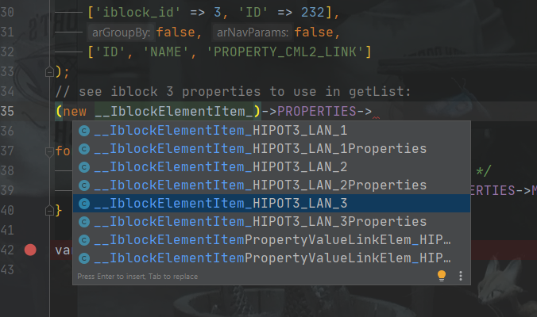
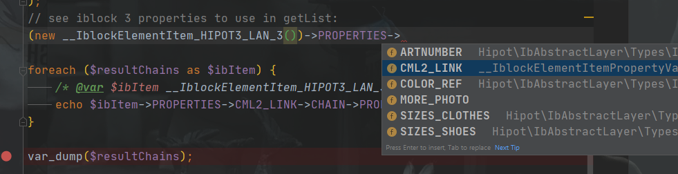
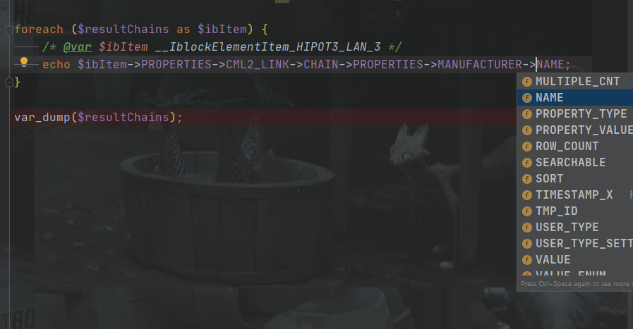

# Мини-фреймворк hipot.framework для создания проектов на bitrix
(с) hipot, 2017 - 2023\
mailto: info AT hipot-studio DOT com


### Требования:
bitrix [main 23.600+](https://dev.1c-bitrix.ru/docs/versions.php?lang=ru&module=main), PHP 8.0+

# Доступные инструменты и возможности:
- библиотека классов <code>/lib/classes</code> для копирования в <code>/local/php_interface/lib/classes</code>
  - объектная модель-обертка <code>Hipot\IbAbstractLayer\IblockElemLinkedChains</code> (Abstract Iblock Elements Layer, см. ниже)
  - класс для работы с инфоблоками <code>Hipot\BitrixUtils\IblockUtils</code>
  - api для трансформации изображений <code>Hipot\Utils\Img</code>
  - класс для работы с кешированием <code>Hipot\BitrixUtils\PhpCacher</code>
    ```php
    /** @global $USER \CUser */
    use Hipot\BitrixUtils\PhpCacher;
    $cachedUser = PhpCacher::cache('cached_users' . PhpCacher::getCacheSubDirById($USER->GetID()), 3600, static fn() => $USER);
    /** @var $cachedUser \CUser */
    \Bitrix\Main\Diag\Debug::dump($cachedUser->GetID());
    ```
  - с магазином <code>Hipot\BitrixUtils\SaleUtils</code> (требует переработи)
  - различные утилиты-хелперы <code>Hipot\Utils\UnsortedUtils</code>
  - различные сервисы в пространстве имен <code>Hipot\Services</code>
  - различные базовые типы в пространстве имен <code>Hipot\Types</code>.
- автозагрузчик к классам <code>lib/simple_loader.php</code> для копирования в <code>/local/php_interface/lib/simple_loader.php</code><br>
В современных реалиях лучше для этого использовать [composer](install/local/composer.json)
- немного "плавающих функций" <code>/lib/functions.php</code>
- универсальные обработчики событий <code>/lib/handlers_add.php</code> с подключением констант-рубильников из файла <code>/lib/constants.php</code>  
- скрипт [xhprof.php](docs/xhprof.md) для быстрого профилирования "боевых" проектов
- страница <code>pages/error.php</code> с перехватом фатальных php-ошибок и отправке их на почту разработчикам (размещается в DOCUMENT_ROOT проекта)
- компоненты в папке <code>install/components</code> для копирования в <code>/local/components</code>
- пример файла <code>/local/php_interface/init.php</code> с подключением деталей фреймворка к битриксу
можно найти в файле include.php

  
### Установка:
Пока для ручного осознанного копирования деталей, в дальнейшем будет модуль <code>hipot.framework</code> с установщиком.
- скопировать папку модуля в папку /local/modules/ (для новых проектов) или /bitrix/modules/ для рабочих
- установить в админке модуль, чтобы он зарегистрировал себя
- можно добавить другие свои нужные классы в автозагрузчик (PSR-4, см. "Стиль написания кода и Структурирование файлов")

### Объектная модель-обертка над инфоблоками: Abstract Iblock Elements Layer
ВАЖНО! После включения Abstract Iblock Elements Layer нужно проиндексировать файл <code>bitrix/modules/generated_iblock_sxem.php</code> в используемой IDE.
Это делается для подсказок (автокомплит кода), по аналогии как в битриксе с аннотациями файл <code>bitrix/modules/orm_annotations.php</code>   

см [ABSTRACT_IBLOCK_ELEMENT_LAYER](docs/ABSTRACT_IBLOCK_ELEMENT_LAYER.MD)

```php
use Bitrix\Main\Loader;
use \Hipot\IbAbstractLayer\IblockElemLinkedChains as hiIblockElemLinkedChains;

Loader::includeModule('hipot.framework');

// example to select some linked elements by linked-chained-class
$resultChains = hiIblockElemLinkedChains::getList(
	['sort' => 'asc'],
	['iblock_id' => 3, 'ID' => 232],
	false, false,
	['ID', 'NAME', 'PROPERTY_CML2_LINK']
);
// see iblock 3 properties to use in getList:
// (new __IblockElementItem_HIPOT3_LAN_3())->PROPERTIES->CML2_LINK

foreach ($resultChains as $ibItem) {
	/** @var $ibItem __IblockElementItem_HIPOT3_LAN_3 */
	echo $ibItem->PROPERTIES->CML2_LINK->CHAIN->PROPERTIES->MANUFACTURER->NAME;
}

var_dump($resultChains);

/* hiIblockElemLinkedChains помимо рекурсивных выборок и объектной модели умеет все, 
 что умеет класс Hipot\BitrixUtils\IblockUtils */
```

рис. смотрим какие классы есть после индексации модели инфоблоков в файл для IDE подсказок <code>/bitrix/modules/generated_iblock_sxem.php</code>:



рис. смотрим какие свойства есть в 3м инфоблоке и какие у них коды для выборки:



рис. имеем code completion для всех типов свойств, в том числе для свойств связанных элементов инфоблоков:




### версия 3.1
- большая часть кода переписана под современные реалии битрикса (d7) и php

### версия 3.0
- собрано все по крупицам с разных мест

### два ключевых аспекта, концепции фреймворка:

1. Это фасад. Т.е. фреймворк оберточного типа.
2. Это микрофрейморк. Т.е. по-минимуму нужных методов, ничего избыточного и лишнего.

### Правила по коду:

- [Стиль написания кода и Структурирование файлов](docs/hipot_code_style_40.pdf)
- [Рекомендации для верстки макетов](docs/hipot_code_html_style_18.pdf)
- Особенно рекомендую заглянуть в раздел документов с использованными материалами

### Дела давно минувших дней и наследие wexpert
В файле [презентация первой версии, 03.09.2014](docs/03.09.2014_SLIDES_10.pptx) представлена моя планерка при выпуске версии 1.0.
Решил ее тоже сохранить, возможно кому-то поможет.