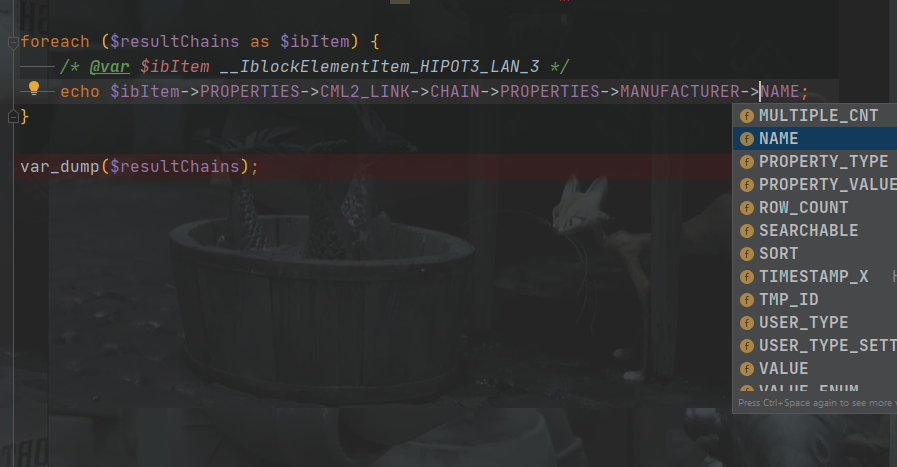

# Мини-фреймворк hipot.framework для создания проектов на bitrix

Данный проект представляет собой мини-фреймворк для разработки на Bitrix, предоставляющий набор переиспользуемых компонентов, утилит и абстракций для упрощения
работы с основными модулями платформы.


(с) hipot studio, 2017 - nowadays\
mailto: info AT hipot-studio DOT com

### Требования:
bitrix [main 23.600+](https://dev.1c-bitrix.ru/docs/versions.php?lang=ru&module=main), PHP 8.3+

# Доступные инструменты и возможности:
- библиотека классов <code>/lib/classes</code> для копирования в <code>/local/php_interface/lib/classes</code>
  - [объектная модель-обертка над инфоблоками](docs/ABSTRACT_IBLOCK_ELEMENT_LAYER.MD) <code>Hipot\IbAbstractLayer\IblockElemLinkedChains</code>. Наследует весь функционал от <code>Hipot\BitrixUtils\Iblock</code> (Abstract Iblock Elements Layer, см. ниже)
  - класс для работы с инфоблоками <code>Hipot\BitrixUtils\Iblock (aka IblockUtils)</code>
  - класс для работы с hightload-блоками <code>Hipot\BitrixUtils\HiBlock</code> и приложение реестра настроек на его основе <code>Hipot\BitrixUtils\HiBlockApps</code>
  - ReadModel для highload-блоков: базовая модель <code>Hipot\Model\HiBaseModel</code>, декоратор <code>Hipot\Model\DataManagerReadModel</code>, backend-контроллер <code>HipotAjaxController</code> и клиентская библиотека <code>hi_model.js</code>
  - api для трансформации изображений и наложения водных знаков [<code>Hipot\Utils\Img</code>](docs/img.md)
  - класс для работы с кешированием [<code>Hipot\BitrixUtils\PhpCacher</code>](docs/cacher.md)
    ```php
    /** @global $USER \CUser */
    use Hipot\BitrixUtils\PhpCacher;
    $cachedUser = PhpCacher::cache('cached_users' . PhpCacher::getCacheSubDirById($USER->GetID()), 3600, static fn() => $USER);
    /** @var $cachedUser \CUser */
    \Bitrix\Main\Diag\Debug::dump($cachedUser->GetID());
    ```
  - [объектная обёртка над агентами Bitrix](docs/agents.md) в пространстве имён <code>Hipot\BitrixUtils\Agent</code>
  - с магазином <code>Hipot\BitrixUtils\Sale (aka SaleUtils)</code> и товаром каталога <code>Hipot\BitrixUtils\Catalog</code>
  - различные утилиты-хелперы <code>Hipot\Utils\UUtils (aka UnsortedUtils)</code> и трейты-хелперы в <code>namespace Hipot\Utils\Helper\\*</code>
  - [генератор определений констант для IDE](docs/constant_ide_helper.md) <code>Hipot\Utils\ConstantIdeHelper</code>
  - для отложенного подключения ресурсов [<code>Hipot\BitrixUtils\AssetsContainer</code>](docs/AssetsContainer.md)
  - различные [сервисы](docs/services.md) в пространстве имен <code>Hipot\Services</code>: не используем global's, используем DTO <code>Hipot\Services\BitrixEngine</code>,
  а для проброса данных между элементами приложения используем <code>Hipot\Services\Registry</code>
  - различные базовые типы в пространстве имен <code>[Hipot\Types](docs/types.md)</code>  

- автозагрузчик к классам <code>lib/simple_loader.php</code> для копирования в <code>/local/php_interface/lib/simple_loader.php</code><br>
В современных реалиях лучше для этого использовать [composer предназначенный для копирования в Bitrix-сайт](src/install/local/composer-example.json)
- немного "плавающих функций" [<code>/lib/functions.php</code>](docs/functions.md)
- универсальные обработчики событий <code>/lib/handlers_add.php</code> с подключением констант-рубильников из файла <code>/lib/constants.php</code>  
- скрипт [xhprof.php](docs/xhprof.md) для быстрого профилирования "боевых" проектов
- страница [<code>pages/error.php</code>](docs/error_php_monitoring.md) с перехватом фатальных php-ошибок и отправке их на почту разработчикам (размещается в DOCUMENT_ROOT проекта)
- [компоненты](docs/components.md) в папке <code>install/components</code> для копирования в <code>/local/components</code>
  - <code>Hipot\Components\IblockList</code> - универсальный компонент для работы с элементами инфоблоков <code>hipot:iblock.list</code>. Этот же компонент умеет использовать и Abstract Iblock Elements Layer. В [теории двух компонент](https://github.com/bitrix-expert/bbc) - этот компонент можно использовать и для создания карточки (детальной страницы) элемента (товара, новости...)
  - <code>Hipot\Components\IblockSection</code> - компонент для работы со списком секций <code>hipot:iblock.section</code>
  - <code>Hipot\Components\HiblockList</code> - список hightload блока <code>hipot:hiblock.list</code>
  - <code>HipotAjaxController контроллер</code>, позволяющий получать readModel-сущности в js через DataManagerReadModel и <code>HipotAjaxComponent</code>, позволяющей загружать динамичные блоки, когда они попадают в viewport, а также для создания любой ajax-логики: <code>hipot.ajax</code>
  - <code>Hipot\Components\Includer</code> элементарный компонент, позволяющий писать включения как шаблоны компонента битрикс (со своим стилем и скриптом, подключаемые вендором): <code>hipot:includer</code>
  - <code>hipot:iblock.menu_ext</code> для создания динамичных _ext-меню по элементам или по секциям инфоблоков
  - <code>hipot:medialibrary.items.list</code> для вывода списка элементов медиабиблиотеки (напр. определенного альбома) в публичную часть
  - <code>Hipot\Components\CommentsBlog</code> для реализации комментариев из модуля блогов к детальным страницам элементов инфоблоков
- пример файла <code>/local/php_interface/init.php</code> с подключением деталей фреймворка к битриксу
можно найти в файле [include.php](src/include.php)

  
### Установка:
Пока для ручного осознанного копирования деталей, в дальнейшем будет модуль <code>hipot.framework</code> с установщиком.
- скопировать папку <code>src</code> модуля в папку /local/modules/ (для новых проектов) или /bitrix/modules/ для рабочих
- установить в админке модуль, чтобы он зарегистрировал себя
- можно добавить другие свои нужные классы в автозагрузчик (PSR-4, см. "Стиль написания кода и Структурирование файлов")
- можно отдельно копировать классы, функции, события и компоненты модуля, часто они самодостаточны и не требуют установки модуля (инкапсуляция на уровне классов/компонентов)

### Объектная модель-обертка над инфоблоками

Подробности про [Abstract Iblock Elements Layer](docs/ABSTRACT_IBLOCK_ELEMENT_LAYER.MD)

### Два ключевых аспекта, концепции фреймворка:

1. Это **фасад**, т.е. фреймворк оберточного типа для удобства использования (facade поверх Bitrix)
2. Это **микрофрейморк**, т.е. по-минимуму нужных методов, ничего избыточного и лишнего (microframework с минимальным набором абстракций).

### Правила по коду:

- [Стиль написания кода и Структурирование файлов](docs/hipot_code_style_41.pdf)
- [Рекомендации для верстки макетов](docs/hipot_code_html_style_18.pdf)
- Особенно рекомендую заглянуть в раздел документов с использованными материалами


