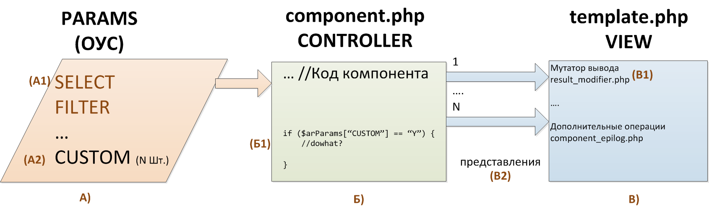

# Базовые компоненты: один механизм — много решений

Эта глава развивает идею статьи «Базовые компоненты `iblock.list`, `iblock.detail`, мутация, варианты использования» и адаптирует её к текущей реализации `hipot.framework`.

Исходная концепция остаётся прежней: типовой проект не должен состоять из десятков почти одинаковых компонентов. Если источник данных и алгоритм выборки совпадают, различия между блоками следует выражать параметрами, подготовкой результата и шаблонами.


## Базовый компонент как конвейер

При работе с элементами инфоблоков большинство задач сводится к одному конвейеру:

1. определить инфоблок и условия выборки;
2. выбрать поля и свойства элементов;
3. при необходимости дополнить или преобразовать результат;
4. закешировать данные;
5. передать подготовленный результат шаблону.

В `hipot.framework` этот конвейер реализует компонент `hipot:iblock.list`, класс которого — `Hipot\Components\IblockList`.

Основные управляющие сигналы компонента:

- `IBLOCK_ID` — источник данных;
- `FILTER` — ограничения выборки;
- `SELECT` — дополнительные поля;
- `ORDER` — сортировка;
- `NTOPCOUNT` и `PAGESIZE` — ограничение результата и постраничная навигация;
- `GET_PROPERTY` — получение свойств;
- `SELECT_CHAINS` и `SELECT_CHAINS_DEPTH` — получение цепочек связанных элементов;
- имя шаблона — способ представления результата.

Сам алгоритм остаётся общим, а сочетание параметров и шаблона превращает его в ленту новостей, карточку товара, баннер, виджет или другой блок сайта.

## Как читать исходную схему сегодня

Историческая схема хорошо показывает границы ответственности, хотя названия файлов и доступные точки расширения изменились.



В текущей реализации элементы схемы соответствуют следующим частям:

| Область схемы | Текущая реализация |
|---|---|
| A1: `SELECT`, `FILTER` | `IBLOCK_ID`, `FILTER`, `SELECT`, `ORDER`, параметры навигации и свойств |
| A2: произвольные параметры | параметры конкретного шаблона и `~MODIFY_ITEM` |
| Б: контроллер | `Hipot\Components\IblockList::executeComponent()` в `class.php` |
| В1: мутатор представления | `result_modifier.php` шаблона |
| В2: представление | `template.php` и `component_epilog.php` |

Компонент всегда добавляет к фильтру `IBLOCK_ID` и `ACTIVE => 'Y'`. В выборку по умолчанию входят `ID`, `IBLOCK_ID`, `DETAIL_PAGE_URL`, `NAME` и `TIMESTAMP_X`; значения из `SELECT` дополняют этот набор.

Результат имеет единый базовый контракт:

```php
$arResult = [
    'ITEMS' => [],
    'CNT_ITEMS' => 0,
    // При включённой постраничной навигации:
    'NAV_STRING' => null,
    'NAV_RESULT' => null,
];
```

## Текущая «теория двух компонентов»: один компонент

В первоначальном варианте концепции использовалась пара базовых компонентов:

- `iblock.list` для списка;
- `iblock.detail` для одного элемента.

Сейчас отдельный `hipot:iblock.detail` не нужен. Детальная страница является списком, ограниченным одним элементом. Общая инфраструктура — загрузка модуля, фильтрация, свойства, связанные элементы, кеширование и 404 — остаётся в одном `hipot:iblock.list`.

| Решение | Отличающиеся параметры | Шаблон |
|---|---|---|
| Лента новостей | фильтр по разделу, `PAGESIZE` | `news.list` |
| Последние новости на главной | сортировка по дате, `NTOPCOUNT` | `news.widget` |
| Карточка новости | фильтр по `ID` или `CODE`, `NTOPCOUNT => 1` | `news.detail` |
| Товарный баннер | бизнес-фильтр, `NTOPCOUNT => 1` | `product.banner` |

### Список элементов

```php
<?php

/** @global CMain $APPLICATION */

$APPLICATION->IncludeComponent(
    'hipot:iblock.list',
    'news.list',
    [
        'IBLOCK_ID' => NEWS_IBLOCK_ID,
        'ORDER' => [
            'ACTIVE_FROM' => 'DESC',
            'SORT' => 'ASC',
        ],
        'FILTER' => [
            'SECTION_ID' => (int)$sectionId,
            'INCLUDE_SUBSECTIONS' => 'Y',
        ],
        'SELECT' => [
            'CODE',
            'ACTIVE_FROM',
            'PREVIEW_TEXT',
            'PREVIEW_PICTURE',
        ],
        'GET_PROPERTY' => 'Y',

        'NTOPCOUNT' => 0,
        'PAGESIZE' => 20,
        'NAV_TEMPLATE' => '.default',
        'NAV_SHOW_ALWAYS' => 'N',
        'NAV_SHOW_ALL' => 'N',
        'NAV_PAGEWINDOW' => 3,

        'SET_404' => 'N',
        'ALWAYS_INCLUDE_TEMPLATE' => 'Y',
        'SELECT_CHAINS' => 'N',
        'SELECT_CHAINS_DEPTH' => 3,
        'CACHE_TIME' => 10800,
        'CACHE_GROUPS' => 'N',
    ],
    false,
    ['HIDE_ICONS' => 'Y'],
);
```

### Детальная страница

```php
<?php

/** @global CMain $APPLICATION */

$APPLICATION->IncludeComponent(
    'hipot:iblock.list',
    'news.detail',
    [
        'IBLOCK_ID' => NEWS_IBLOCK_ID,
        'FILTER' => [
            'CODE' => $elementCode,
        ],
        'SELECT' => [
            'ACTIVE_FROM',
            'DETAIL_TEXT',
            'DETAIL_PICTURE',
        ],
        'GET_PROPERTY' => 'Y',

        'NTOPCOUNT' => 1,
        'PAGESIZE' => 0,
        'SET_404' => 'Y',
        'ALWAYS_INCLUDE_TEMPLATE' => 'N',
        'SELECT_CHAINS' => 'N',
        'SELECT_CHAINS_DEPTH' => 3,
        'CACHE_TIME' => 10800,
        'CACHE_GROUPS' => 'N',
    ],
    false,
    ['HIDE_ICONS' => 'Y'],
);
```

Детальный шаблон продолжает работать с общим контрактом `ITEMS`:

```php
<?php

$item = $arResult['ITEMS'][0] ?? null;
if ($item === null) {
    return;
}

// Вывод детальной страницы.
```

Если выборка пуста, `SET_404 => 'Y'` устанавливает статус 404. При `ALWAYS_INCLUDE_TEMPLATE => 'N'` пустой детальный шаблон не подключается.

## Уровни изменения решения

Под мутацией здесь понимается программное преобразование результата, которое нельзя выразить только параметрами выборки. Важно выбрать минимально достаточную точку расширения.

### 1. Параметры без дополнительного кода

Сначала следует проверить, решается ли задача через `FILTER`, `SELECT`, `ORDER`, `GET_PROPERTY`, `SELECT_CHAINS` и ограничения выборки.

Это предпочтительный вариант: компонент остаётся типовым, а вызов явно описывает необходимые данные. Например, поле связанного элемента не всегда требует ручного запроса — текущая реализация также умеет строить цепочки связанных элементов через `SELECT_CHAINS => 'Y'` и контролировать их глубину параметром `SELECT_CHAINS_DEPTH`.

### 2. `result_modifier.php` для одного представления

Если преобразование нужно только конкретному шаблону, его место — в `result_modifier.php`:

```php
<?php

foreach ($arResult['ITEMS'] as &$item) {
    $item['VIEW'] = [
        'TITLE' => (string)$item['NAME'],
        'URL' => (string)$item['DETAIL_PAGE_URL'],
        'CSS_CLASS' => $item['PROPERTIES']['FEATURED']['VALUE'] === 'Y'
            ? 'card--featured'
            : 'card',
    ];
}
unset($item);
```

`template.php` после этого только отображает подготовленную модель. Запросы и сложные преобразования непосредственно в шаблоне вывода размещать не следует.

### 3. Общая поэлементная мутация через `~MODIFY_ITEM`

Когда одна и та же подготовка элемента нужна нескольким шаблонам, компонент поддерживает callback в параметре `~MODIFY_ITEM`. Замыкание сериализуется библиотекой `opis/closure` и вызывается для каждого элемента до добавления в `ITEMS`:

```php
<?php

use function Opis\Closure\serialize as serializeClosure;

$modifyItem = static function (array &$item): void {
    $item['VIEW']['IS_NEW'] = strtotime((string)$item['ACTIVE_FROM']) > strtotime('-7 days');
};

$APPLICATION->IncludeComponent(
    'hipot:iblock.list',
    'news.list',
    [
        'IBLOCK_ID' => NEWS_IBLOCK_ID,
        'SELECT' => ['ACTIVE_FROM'],
        'GET_PROPERTY' => 'N',
        'PAGESIZE' => 20,
        'CACHE_TIME' => 10800,
        'CACHE_GROUPS' => 'N',
        '~MODIFY_ITEM' => serializeClosure($modifyItem),
    ],
);
```

Callback должен быть детерминирован относительно параметров и кеша компонента. Не следует неявно захватывать текущего пользователя, запрос или другое персональное состояние: результат может попасть в общий кеш. Если персонализация действительно нужна, она должна участвовать в разделении кеша либо выполняться после получения общего результата.

### 4. Отдельный проектный компонент

Новый компонент оправдан, когда меняется не представление и не подготовка одного элемента, а сам алгоритм:

- используется другой источник данных;
- требуется транзакционный сценарий или запись;
- выборка состоит из нескольких самостоятельных агрегатов;
- у результата другой устойчивый контракт;
- типовой конвейер приходится обходить сразу в нескольких местах.

Код установленного `hipot:iblock.list` не следует изменять под конкретный проект. Если задача действительно нетиповая, создаётся отдельный проектный компонент или осознанная проектная реализация, а не патч vendor-кода.

## Как выбрать уровень расширения

Используйте следующий порядок:

1. выразить выборку параметрами компонента;
2. подготовить данные одного представления в `result_modifier.php`;
3. вынести общую поэлементную подготовку в `~MODIFY_ITEM`;
4. создать отдельный компонент, если изменился сам алгоритм и контракт результата.

Если одна и та же логика скопирована в несколько `result_modifier.php`, это сигнал поднять её на общий уровень. Если компонент оброс множеством несвязанных произвольных флагов, это обратный сигнал: одна универсальная абстракция начала обслуживать несколько разных задач и её пора разделить.

## Семейство базовых компонентов

Тот же принцип используется и в других компонентах `hipot.framework`:

- `hipot:hiblock.list` получает записи highload-блока;
- `hipot:iblock.section` получает разделы инфоблока;
- `hipot:medialibrary.items.list` получает элементы медиабиблиотеки;
- `hipot:medialibrary.collection.list` получает коллекции медиабиблиотеки.

У каждого компонента свой источник данных, но границы остаются одинаковыми: параметры описывают выборку, компонент получает и кеширует данные, `result_modifier.php` строит модель представления, а `template.php` выводит её.

Подробный контракт и дополнительные примеры `hipot:iblock.list` приведены в [документации компонента](components/hipot_iblock_list.md).

## Итоги

- Типовой сайт не требует отдельного компонента для каждого визуального блока.
- `hipot:iblock.list` обслуживает и списки, и детальные страницы.
- Источник, фильтр, поля и ограничение выборки задаются параметрами.
- Представление не должно управлять выборкой.
- Локальная подготовка результата выполняется в `result_modifier.php`.
- Общую поэлементную мутацию можно передать через `~MODIFY_ITEM`.
- Новый компонент нужен тогда, когда изменился алгоритм, а не только параметры или шаблон.

## Источники

- [Исходная статья «Базовые компоненты iblock.list, iblock.detail, мутация, варианты использования»](https://www.hipot-studio.com/Codex/base-components-mutator/).
- См. также: [«Базовые битриксовые компоненты»](https://github.com/bitrix-expert/bbc).
