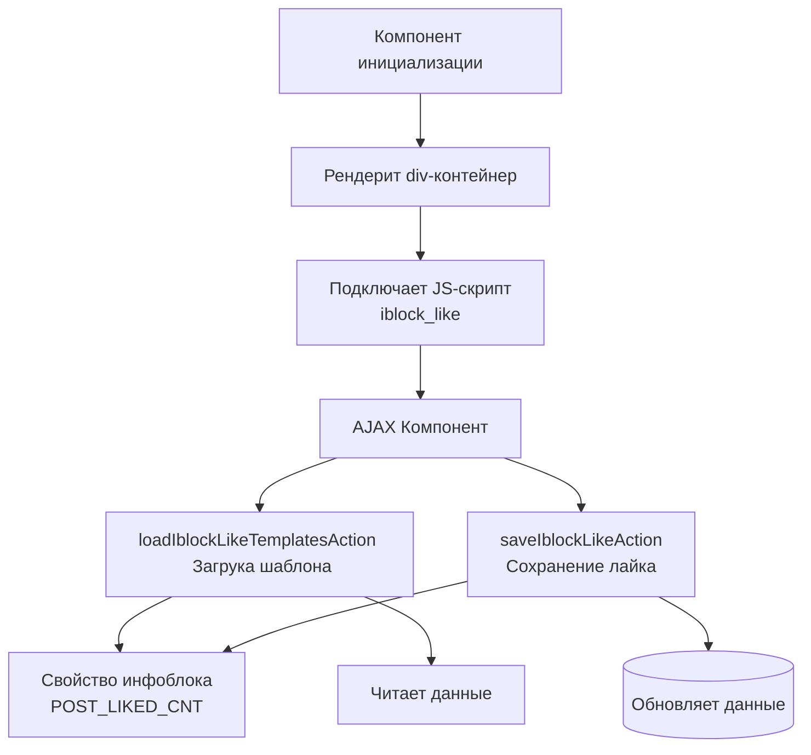

# Компонент лайков
Компонент позволяет добавить возможность ставить "лайк" элементам инфоблока и отображение их кол-ва. Компонент не зависит от кеша родительского компонента. Для каждого посетителя всегда будут актуальные блоки лайков не зависимо от кеша самого списка.

## Пример подключения:

```php
// bitrix/catalog.detail/templates/.default/template.php

/** @var array $arResult */
/** @var CBitrixComponent $component */

<?$APPLICATION->IncludeComponent('hipot:ajax', 'iblock_like', [
    'ITEM'          => $arResult,
    'MODE'          => 'init'
], $component, ['HIDE_ICONS' => true]);
?>
```

--- 

После подключения компонента, необходимо добавить свойство в инфоблок ***`POST_LIKED_CNT`*** которое будет отвечать за кол-во лайков для текущего элемента. В момент иницализации компонента, рендерится `div` элемент, саму подгрузку инициирует `js-скрипт` в шаблоне `iblock_like`. Для загрузки интерфейса используется наш [ajax][1] компонент.

## Диграмма инициализации и взаимодействия с методами ajax компонента


## Методы ajax компонента:
-  [`loadIblockLikeTemplatesAction`][2] - Чтобы нарисовать интерфейс с кнопкой лайка
-  [`saveIblockLikeAction`][3] - Чтобы сохранить клик в базе данных

## Пример работы компонента


## Пошаговая инструкция использования
1/ взять компонент из hipot:ajax фрейморка + завести свойство в инфоблоке POST_LIKED_CNT

2/ сделать свой шаблон iblock_like этого компонента по пути SITE_TEMPLATE_PATH/components/hipot/ajax/iblock_like, который используется дважды:

2.1/ при вызове на странице с параметром init:
```php
// bitrix/catalog.detail/templates/.default/template.php
<div class="func-right">
   <?$APPLICATION->IncludeComponent('hipot:ajax', 'iblock_like', [
     'ITEM'          => $item,
     'MODE'          => 'init'
   ], $component, ['HIDE_ICONS' => true])?>
</div>
```
в этот момент рисуется просто пустая дивка, куда будет [подгружен интрефейс][2].

саму подгрузку инициирует js-скрипт в шаблоне [iblock_like][4]. 

2.2/
В эту дивку аяксом подружается через действие [`loadIblockLikeTemplatesAction()`][2] нужный интерфейс.
Тут нужно сделать верстку конкретного проекта (режим load):<br>
в этом интрерфейсе за обработку клика отвечает тоже [js-скрипт в шаблоне][5]<br>
Клик сохранятеся в локалномХранилище браузера и в сессии.

[1]:https://github.com/hipot-studio/hipot.framework/tree/master/install/components/hipot/ajax
[2]:https://github.com/hipot-studio/mgu-russian.com/blob/master/local/components/mgu/ajax/class.php#L131
[3]:https://github.com/hipot-studio/mgu-russian.com/blob/master/local/components/mgu/ajax/class.php#L168
[4]:https://github.com/hipot-studio/hipot.framework/blob/master/install/components/hipot/ajax/templates/iblock_like/script.js#L19
[5]:https://github.com/hipot-studio/hipot.framework/blob/master/install/components/hipot/ajax/templates/iblock_like/script.js#L49
