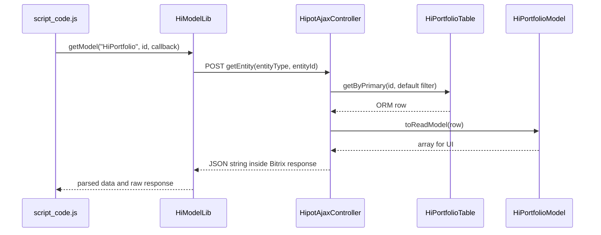

# ReadModel для highload-блоков

Механика ReadModel связывает запись highload-блока с подготовленной для интерфейса структурой данных. Серверная часть выбирает запись через ORM Bitrix, прикладной класс `*Model` преобразует её в массив, а `hipot:ajax` передаёт результат клиентскому коду через `hi_model.js`.

ReadModel подходит для экранов, которым нужно читать одну сущность по ID, получать первую и последнюю запись выборки и переключаться между соседними записями. Запись и изменение данных в этот контракт не входят.

Основные исходники:

- [`Hipot\Model`](../src/lib/classes/Hipot/Model/);
- [`HipotAjaxController`](../../hipot.framework2/src/install/components/hipot/ajax/ajax.php);
- [`HipotAjaxComponent`](../../hipot.framework2/src/install/components/hipot/ajax/class.php);
- [`hi_model.js`](../../hipot.framework2/src/install/components/hipot/ajax/js/hi_model.js).

## Участники и их ответственность

| Элемент | Ответственность |
|---|---|
| `Hipot\Model\HiBaseModel` | Базовый класс прикладной модели. Задаёт `toReadModel()` и `getDefaultFilter()`, а также преобразует имена `*Table` и `*Model` друг в друга. |
| `Hipot\Model\DataManagerReadModel` | Получает запись динамического `DataManager` по ID, применяет обязательный фильтр и вызывает `toReadModel()`. |
| `Hipot\Model\EntityHelper` | Даёт модели утилиты из `EO_Utils`, в том числе поиск соседних записей и статистику выборки. |
| `HipotAjaxController` | Предоставляет действия `getEntity` и `getEntityStat` компонента `hipot:ajax`. |
| `hi_model.js` | Создаёт глобальный объект `HiModelLib` и оборачивает вызовы `BX.ajax.runComponentAction()`. |
| Прикладной класс, например `HiPortfolioModel` | Решает, какие поля увидит браузер и как будут подготовлены связи, файлы, даты и вычисляемые значения. |

`HiBaseModel` не является ORM-классом и не наследует `DataManager`. ORM-класс highload-блока создаёт Bitrix, например `HiPortfolioTable`, а прикладной `HiPortfolioModel` служит преобразователем его строки.



## Требования

- Компонент должен быть установлен в `/local/components/hipot/ajax`.
- На сервере должны загружаться классы `Hipot\Model\*` и прикладной класс `*Model`.
- Модуль `highloadblock` обязателен для этого сценария. Его следует загрузить при инициализации приложения через `Bitrix\Main\Loader::requireModule('highloadblock')`.
- На странице должны быть доступны JS-ядро Bitrix и `BX.ajax`.
- Имя highload-блока, динамического ORM-класса и модели должно соблюдать соглашение, описанное ниже.

## Соглашение об именах

Для highload-блока с `NAME = HiPortfolio` Bitrix создаёт динамический класс `HiPortfolioTable`. `DataManagerReadModel` заменяет суффикс `Table` на `Model` и ищет класс `HiPortfolioModel`.

| Назначение | Имя |
|---|---|
| `NAME` highload-блока | `HiPortfolio` |
| Динамический класс Bitrix | `HiPortfolioTable` |
| Прикладная ReadModel | `HiPortfolioModel` |
| Значение `entityName` в JavaScript | `HiPortfolio` |

Модель должна находиться в том же пространстве имён, что и скомпилированный `*Table`, потому что имя строится простой заменой строки. Для стандартного динамического класса HL-блока это обычно глобальное пространство имён.

## Создание модели

Минимальная модель наследуется от `HiBaseModel` и переопределяет два метода:

```php
<?php

use Bitrix\Main\Type\Date;
use Hipot\Model\EntityHelper;
use Hipot\Model\HiBaseModel;

final class HiPortfolioModel extends HiBaseModel
{
	public static function toReadModel(array $row): array
	{
		if ($row['UF_DATETIME'] instanceof Date) {
			$row['DATETIME'] = FormatDate(
				'j F Y',
				$row['UF_DATETIME']->getTimestamp()
			);
		}

		unset($row['UF_DATETIME'], $row['UF_INTERNAL_NOTE']);

		$row += EntityHelper::getNextPrevElementsById(
			(int)$row['ID'],
			['UF_DATETIME' => 'DESC'],
			['ID', 'UF_TEXT'],
			self::getDefaultFilter(),
			self::getDataManagerClass(self::class)
		);

		return $row;
	}

	public static function getDefaultFilter(): array
	{
		return [
			'=UF_ACTIVE' => 1,
		];
	}
}
```

### `toReadModel(array $row): array`

Метод получает результат `fetch()` для одной записи и возвращает готовый контракт интерфейса. Здесь можно:

- удалить служебные и закрытые поля;
- переименовать поля `UF_*` в понятные клиенту ключи;
- преобразовать `Date` и `DateTime` в строки;
- получить связанные записи других highload-блоков;
- подготовить данные файлов и изображений;
- добавить вычисляемые поля, например `PREV` и `NEXT`.

Форма возвращаемого массива является публичным API клиентского приложения. Изменение ключа в `toReadModel()` требует соответствующего изменения JavaScript-кода.

### `getDefaultFilter(): array`

Метод возвращает обязательный ORM-фильтр модели. В примере неактивная запись не должна попадать ни в `getEntity`, ни в статистику:

```php
public static function getDefaultFilter(): array
{
	return ['=UF_ACTIVE' => 1];
}
```

Для `getEntityStat` клиентский фильтр объединяется с фильтром модели так, что значения `getDefaultFilter()` имеют приоритет при совпадении строковых ключей. Этот фильтр следует считать серверным ограничением, а переданный из браузера `filter` — дополнительным условием выборки.

## Что делает `HiPortfolioModel` из примера приложения

Приложенный класс показывает расширенный вариант преобразования:

1. Оставляет в выдаче только активные записи через `UF_ACTIVE = 1`.
2. Нормализует множественные поля `UF_SECTIONS` и `UF_IMAGES`.
3. Загружает связанные записи из HL-блока `HiPortfolioSections`.
4. Преобразует ID файлов в варианты изображений `SMALL` и `FULL`.
5. Форматирует `UF_DATETIME` в поле `DATETIME`.
6. Добавляет `PREV` и `NEXT` в порядке `UF_DATETIME DESC`.
7. Удаляет технические поля, которые больше не нужны клиенту.

В исходном приложении изображения возвращаются как `IMAGES[0]`, поэтому `script_code.js` проходит по `dataPost.IMAGES[0]`. Для нового контракта удобнее вернуть плоский список:

```php
$row['IMAGES'] = $filledImages;
```

и читать его на клиенте как `dataPost.IMAGES`. Выбранную форму нужно сохранять одинаковой на обеих сторонах.

## Подключение клиентской библиотеки

Сначала загрузите класс компонента, JS-ядро Bitrix и `hi_model.js`, затем прикладной скрипт:

```php
<?php

use Bitrix\Main\Page\Asset;

\CBitrixComponent::includeComponentClass('hipot:ajax');
\CJSCore::Init(['ajax']);

HipotAjaxComponent::addHiModelToPage();
Asset::getInstance()->addJs(
	$this->getTemplate()->GetFolder() . '/script_code.js'
);
```

Именно так построено приложение портфолио: `component_epilog.php` подключает `hi_model.js` перед `script_code.js`.

`addHiModelToPage()` использует фиксированный путь `/local/components/hipot/ajax/js/hi_model.js`. Если компонент установлен в другом месте, подключите файл через `Asset` по фактическому URL.

## Клиентский API

После подключения доступен глобальный объект `HiModelLib`.

### Получение одной модели

```javascript
HiModelLib.getModel('HiPortfolio', 42, function (portfolio, response) {
	if (response.status !== 'success') {
		console.error(response.errors ?? response);
		return;
	}

	console.log(portfolio.ID);
	console.log(portfolio.DATETIME);
	console.log(portfolio.PREV);
	console.log(portfolio.NEXT);
});
```

Параметры `getModel(entityName, id, callback)`:

| Параметр | Значение |
|---|---|
| `entityName` | `NAME` highload-блока, например `HiPortfolio`. |
| `id` | ID записи. На сервере параметр приводится к `int`. |
| `callback` | Получает подготовленную модель и исходный ответ `BX.ajax`. |

### Получение статистики выборки

```javascript
HiModelLib.getModelStat(
	'HiPortfolio',
	{'UF_DATETIME': 'DESC'},
	{},
	function (stat, response) {
		if (response.status !== 'success') {
			console.error(response.errors ?? response);
			return;
		}

		console.log(stat.START_ID);
		console.log(stat.END_ID);
		console.log(stat.TOTAL_ROWS);
	}
);
```

Результат содержит:

| Поле | Значение |
|---|---|
| `START_ID` | ID первой записи в заданном порядке. |
| `END_ID` | ID последней записи. |
| `TOTAL_ROWS` | Число записей с учётом клиентского и обязательного фильтров. |

`entityOrder` должен содержать одну пару `поле: направление`: контроллер читает только первый ключ и первое значение массива. `filter` использует формат ORM-фильтра Bitrix.

### Загрузка первой записи

Базовый сценарий из приложения сначала получает границы выборки, затем загружает последнюю запись портфолио:

```javascript
function initPortfolio() {
	HiModelLib.getModelStat(
		'HiPortfolio',
		{'UF_DATETIME': 'DESC'},
		{},
		function (stat, response) {
			if (response.status !== 'success' || !stat.START_ID) {
				return;
			}

			HiModelLib.getModel(
				'HiPortfolio',
				stat.START_ID,
				function (portfolio, modelResponse) {
					if (modelResponse.status === 'success') {
						renderPortfolio(portfolio);
					}
				}
			);
		}
	);
}
```

Для кода на `async/await` callback можно один раз обернуть в `Promise`:

```javascript
function loadModel(entityName, id) {
	return new Promise(function (resolve, reject) {
		HiModelLib.getModel(entityName, id, function (data, response) {
			if (response.status === 'success') {
				resolve(data);
				return;
			}

			reject(response);
		});
	});
}

const portfolio = await loadModel('HiPortfolio', 42);
renderPortfolio(portfolio);
```

## Серверный API

`HipotAjaxController` предоставляет два POST-действия. Оба защищены CSRF-фильтром Bitrix.

### `getEntity`

Входные данные:

```text
entityType = HiPortfolio
entityId   = 42
```

Контроллер:

1. Находит HL-блок по `NAME = entityType`.
2. Компилирует его динамический `DataManager`.
3. Строит имя модели заменой `Table` на `Model`.
4. Выбирает запись по ID с `getDefaultFilter()`.
5. Вызывает `toReadModel()`, если соответствующий класс модели найден.
6. Возвращает JSON-строку с результатом.

### `getEntityStat`

Входные данные:

```text
entityType  = HiPortfolio
entityOrder = {"UF_DATETIME":"DESC"}
filter      = {}
```

Действие объединяет фильтр браузера с `getDefaultFilter()`, а затем получает первый ID, последний ID и количество записей. В текущей реализации запросы первого и последнего ID кешируются на семь дней; запрос количества не получает явной настройки кеша.

### Формат ответа

Actions возвращают JSON как строку внутри стандартного ответа Bitrix. Поэтому `hi_model.js` выполняет `JSON.parse(response.data)` и передаёт callback уже разобранный объект.

При успешном вызове callback получает:

```javascript
function (data, response) {
	// data — результат JSON.parse(response.data)
	// response — полный ответ BX.ajax.runComponentAction
}
```

При отклонённом Promise библиотека вызывает callback с пустым объектом `{}` и исходным объектом ошибки.

## Использование на PHP без AJAX

Тот же преобразователь можно вызвать на сервере:

```php
use Bitrix\Main\Loader;
use Hipot\BitrixUtils\HiBlock;
use Hipot\Model\DataManagerReadModel;

Loader::requireModule('highloadblock');

$dataManager = HiBlock::getHightloadBlockTable(
	0,
	'HiPortfolio',
	true
);

$portfolio = DataManagerReadModel::buildById(
	$dataManager,
	42
)->getEntityObject();
```

Так PHP-код и браузер получают одну и ту же форму данных.

## Безопасность публичного endpoint

CSRF-фильтр подтверждает, что запрос пришёл из текущей сессии, но сам по себе не проверяет право пользователя читать сущность. Текущий контроллер также не содержит списка разрешённых HL-блоков: `entityType`, `filter` и поле сортировки приходят из браузера.

Перед использованием механики в публичной части приложения нужно:

- разрешить только заранее известные значения `entityType`;
- проверить права текущего пользователя на сущность;
- ограничить разрешённые поля фильтра и сортировки;
- возвращать только явно сформированный массив из `toReadModel()`;
- не передавать закрытые поля, токены и внутренние идентификаторы;
- обрабатывать отсутствующий HL-блок и запись с неизвестным ID как штатную ошибку.

Если класс `*Model` не найден, текущий `DataManagerReadModel` возвращает исходную ORM-строку без преобразования. Поэтому отсутствие модели нельзя использовать как безопасный режим по умолчанию.

При вставке данных в DOM используйте `textContent` для обычного текста. Значения, которые приложение передаёт в `innerHTML`, должны быть очищены на сервере согласно их контракту; одного преобразования в ReadModel для защиты от XSS недостаточно.

## Ограничения текущей реализации

- Имя модели вычисляется простой заменой всех вхождений `Table` на `Model`; нестандартные имена классов не поддерживаются.
- `buildById()` ожидает существующую запись. Если `fetch()` вернёт `false`, значение нельзя будет передать ни в типизированный `toReadModel(array $row)`, ни в конструктор `DataManagerReadModel`, принимающий массив.
- `getEntityStat()` рассчитан на одну пару сортировки.
- `getEntityStat()` обращается к элементам результата как к массиву, поэтому пустую выборку следует обрабатывать в прикладном контроллере или дорабатывать базовый action.
- Клиентская библиотека зависит от глобальных `BX` и `HiModelLib` и использует callback API.
- Контроллер кодирует данные вручную через `Json::encode()`, поэтому клиенту требуется дополнительный `JSON.parse()`.

Эти пункты описывают фактический контракт текущего кода и важны при расширении механики или создании собственного контроллера поверх `Hipot\Model`.
