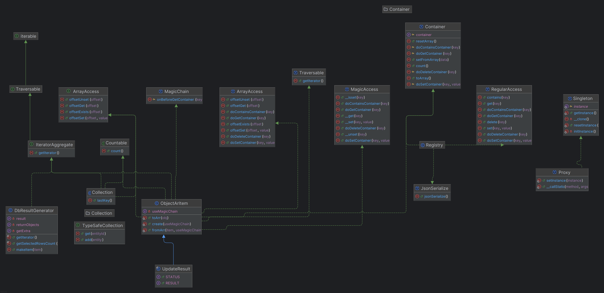
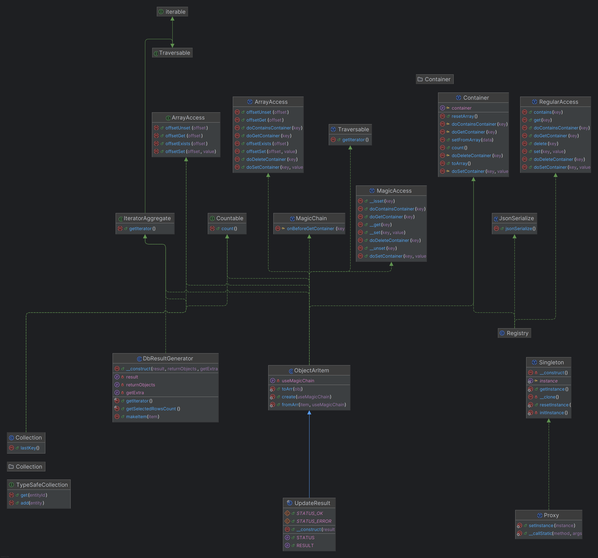

## Специальные базовые типы фреймворка

// todo: показать примеры использования

1/ Примитивная структура хранения ObjectArItem по подобию индексированного массива

Подтип UpdateResult этого объекта для описания результата.

2/ Итератор DbResultGenerator для создания базовых ObjectArItem из результатов битриксов

3/ Коллекции и наборы с доступом к данным и сериализацией

Для обхода по ним, разименования по индексу...

Тип коллекций для магического доступа к свойствам Abstract Layer

4/ Самый примитивный Singleton одиночка для быстрого создания такого типа

5/ Обертка Proxy для этого Singleton'а

