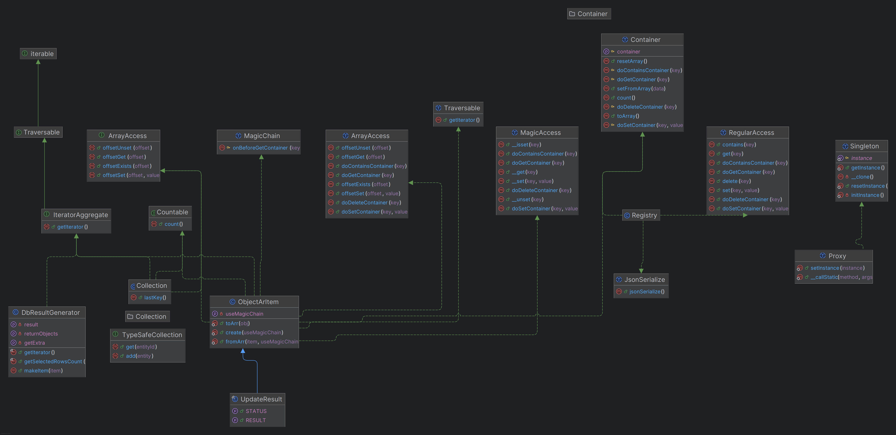
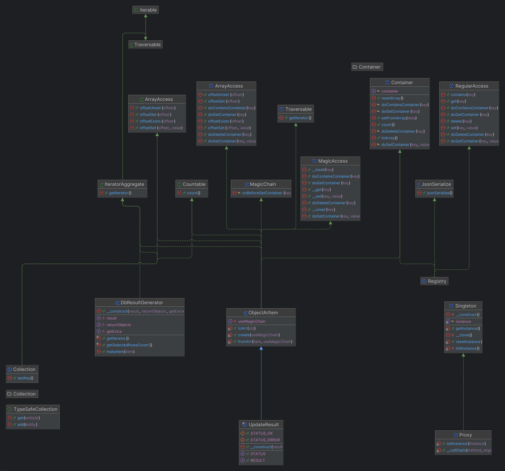

# Типы `Hipot\Types`

Пространство имён `Hipot\Types` содержит небольшие типы и traits для объектов, коллекций, контейнеров данных, singleton-объектов и статических proxy-фасадов.

Часть идей заимствована из [Bluz Framework: Traits](https://github.com/bluzphp/framework/wiki#traits), но описание ниже относится к фактической реализации `hipot.framework`.



## Состав пространства имён

| Тип | Назначение |
|---|---|
| `ObjectArItem` | Объектная обёртка над массивом с доступом через `[]`, свойства и `foreach` |
| `UpdateResult` | Результат операции записи: статус и идентификатор либо текст ошибки |
| `Registry` | Экземпляр простого key-value реестра |
| `Collection\Collection` | Коллекция на базе SPL `ArrayObject` |
| `Collection\TypeSafeCollection` | Минимальный контракт типизированной коллекции `ObjectArItem` |
| `Singleton` | Trait ленивого создания единственного экземпляра класса |
| `Proxy` | Trait статического proxy к singleton-экземпляру |
| `Container\*` | Traits, из которых можно собрать собственный контейнер данных |

## `ObjectArItem`

`Hipot\Types\ObjectArItem` хранит данные во внутреннем массиве и реализует `ArrayAccess`, `Countable` и `IteratorAggregate`.

Один и тот же ключ можно читать как индекс массива или как свойство:

```php
<?php

use Hipot\Types\ObjectArItem;

$item = ObjectArItem::fromArr([
    'ID' => 42,
    'NAME' => 'Новость',
    'META' => [
        'AUTHOR' => 'Редакция',
    ],
]);

echo $item['ID'];          // 42
echo $item->NAME;          // Новость
echo $item->META->AUTHOR;  // Редакция

$item['ACTIVE'] = 'Y';
$item->SORT = 100;

if (isset($item->META)) {
    unset($item->META);
}
```

### Создание

Пустой объект создаётся через `create()`:

```php
$item = ObjectArItem::create();
$item->ID = 42;
$item->NAME = 'Новость';
```

`fromArr()` рекурсивно превращает все вложенные массивы в `ObjectArItem`:

```php
$item = ObjectArItem::fromArr([
    'ID' => 42,
    'TAGS' => [
        ['ID' => 1, 'NAME' => 'PHP'],
        ['ID' => 2, 'NAME' => 'Bitrix'],
    ],
]);

echo $item->TAGS[0]->NAME; // PHP
```

Это касается и ассоциативных массивов, и списков: `TAGS` в примере тоже является `ObjectArItem`, доступным через `ArrayAccess`.

### Перебор и количество элементов

```php
foreach ($item as $key => $value) {
    echo $key . ': ' . get_debug_type($value) . PHP_EOL;
}

echo count($item);
```

### Получение массива

`toArray()` возвращает только верхний уровень контейнера. Вложенные значения `ObjectArItem` остаются объектами:

```php
$data = $item->toArray();
echo $data['TAGS'][0]->NAME;
```

Текущая реализация статического `ObjectArItem::toArr()` обходит свойства PHP-объекта, поэтому при передаче самого `ObjectArItem` в результат попадают его служебные поля `container` и `useMagicChain`. Его не следует считать обратной операцией к `fromArr()` и использовать для формирования публичного DTO без дополнительной нормализации.

Для рекурсивной выгрузки именно содержимого контейнеров можно использовать локальный нормализатор:

```php
<?php

use Hipot\Types\ObjectArItem;

function normalizeObjectArItem(mixed $value): mixed
{
    if ($value instanceof ObjectArItem) {
        $value = $value->toArray();
    }

    if (is_array($value)) {
        foreach ($value as $key => $nestedValue) {
            $value[$key] = normalizeObjectArItem($nestedValue);
        }
    }

    return $value;
}

$array = normalizeObjectArItem($item);
```

### Magic chain

`ObjectArItem::create(true)` включает автоматическое создание отсутствующего промежуточного объекта при чтении свойства:

```php
$item = ObjectArItem::create(useMagicChain: true);
$item->VIEW->TITLE = 'Карточка товара';
```

Этот режим изменяет объект даже во время чтения отсутствующего ключа. Кроме того, текущая реализация не передаёт флаг `useMagicChain` автоматически созданному дочернему объекту, поэтому безопасно рассчитывать только на один создаваемый промежуточный уровень.

Для обычных прикладных данных предпочтительнее явная инициализация через `fromArr()`:

```php
$item = ObjectArItem::fromArr([
    'VIEW' => [
        'SEO' => [],
    ],
]);

$item->VIEW->SEO->TITLE = 'Карточка товара';
```

При проверке цепочки используйте `isset()`:

```php
if (isset($item->VIEW->SEO)) {
    // Ключ существует.
}
```

Сравнение отсутствующей цепочки с `null` может вызвать побочное создание ключа. Поэтому magic chain предназначен прежде всего для тестов и коротких структур, а не для основной доменной модели.

## `UpdateResult`

`Hipot\Types\UpdateResult` используется legacy-методами записи в инфоблоки и возвращает два значения:

- `STATUS` — `UpdateResult::STATUS_OK` или `UpdateResult::STATUS_ERROR`;
- `RESULT` — идентификатор созданной/изменённой записи либо текст ошибки.

Пример добавления элемента:

```php
<?php

use Hipot\BitrixUtils\Iblock;
use Hipot\Types\UpdateResult;

$result = Iblock::addElementToDb([
    'IBLOCK_ID' => CATALOG_IBLOCK_ID,
    'ACTIVE' => 'Y',
    'NAME' => 'Новый элемент',
]);

if ($result['STATUS'] === UpdateResult::STATUS_OK) {
    $elementId = (int)$result['RESULT'];
} else {
    $errorMessage = (string)$result['RESULT'];
}
```

В текущей реализации конструктор записывает значения во внутренний контейнер, а публичные типизированные свойства `$STATUS` и `$RESULT` не инициализирует. Поэтому рабочий и однозначный способ чтения результата — через `[]`, как в примере. Обращение `$result->STATUS` может завершиться ошибкой неинициализированного типизированного свойства.

Для нового service-кода, которому нужен расширяемый outcome-контракт и коллекция ошибок, предпочтителен штатный `Bitrix\Main\Result`. `UpdateResult` нужен прежде всего для совместимости с существующими helper-методами.

## `DbResultGenerator` и `ObjectArItem`

Итератор находится в сервисном пространстве имён `Hipot\Services`, но тесно связан с типами. Он оборачивает результаты выборок Bitrix, а при `returnObjects: true` создаёт `ObjectArItem` для каждой строки.

```php
<?php

use Hipot\BitrixUtils\Iblock;
use Hipot\Services\DbResultGenerator;
use Hipot\Types\ObjectArItem;

$dbResult = Iblock::selectElementsByFilter(
    ['ID' => 'ASC'],
    ['IBLOCK_ID' => CATALOG_IBLOCK_ID, 'ACTIVE' => 'Y'],
    false,
    false,
    ['ID', 'IBLOCK_ID', 'NAME']
);

$iterator = new DbResultGenerator($dbResult, returnObjects: true);

foreach ($iterator as $item) {
    /** @var ObjectArItem $item */
    echo $item->ID . ': ' . $item->NAME . PHP_EOL;
}

echo $iterator->getSelectedRowsCount();
```

Все строки можно получить сразу:

```php
/** @var ObjectArItem[] $items */
$items = (new DbResultGenerator($dbResult, returnObjects: true))->fetchAll();
```

Итератор потребляет исходный result set. Не следует сначала полностью пройти его через `foreach`, а затем ожидать тот же набор данных от `fetchAll()`.

Для legacy `CDBResult` перебор через `foreach` использует `Fetch()` либо `GetNext()`, если конструктору передан `getExtra: true`. `GetNext()` подготавливает HTML-safe значения, сохраняя исходные значения в полях с префиксом `~` по правилам Bitrix.

У текущей реализации есть ограничение для ORM-результатов, реализующих `IteratorAggregate`: `fetchAll()` их обрабатывает, но ветка `getIterator()` возвращает вложенный итератор из генератора без `yield from`, поэтому обычный `foreach` не отдаёт строки. До исправления этой ветки для ORM используйте `fetchAll()`.

Подробнее о сервисе: [Сервисный слой](services.md).

## `Collection\Collection`

`Hipot\Types\Collection\Collection` наследует SPL-класс `ArrayObject`, поэтому поддерживает индексный доступ, перебор, `count()` и стандартные методы `ArrayObject`.

```php
<?php

use Hipot\Types\Collection\Collection;

$items = new Collection([
    ['ID' => 10, 'NAME' => 'Первый'],
    ['ID' => 20, 'NAME' => 'Второй'],
]);

$items->append(['ID' => 30, 'NAME' => 'Третий']);

foreach ($items as $item) {
    echo $item['NAME'] . PHP_EOL;
}

echo count($items);       // 3
echo $items->lastKey();   // 2
```

`lastKey(): int` рассчитан на непустую коллекцию с целочисленными ключами. Для пустой коллекции `array_key_last()` возвращает `null`, а для ассоциативной может вернуть строку; оба варианта не соответствуют объявленному `int`. Перед вызовом проверяйте структуру:

```php
if (count($items) > 0) {
    $lastItem = $items[$items->lastKey()];
}
```

## `Collection\TypeSafeCollection`

Интерфейс задаёт минимальный контракт коллекции объектов `ObjectArItem`:

```php
public function add(ObjectArItem $entity): void;
public function get(int $entityId): ObjectArItem;
```

Пример реализации с индексом по `ID`:

```php
<?php

use Hipot\Types\Collection\TypeSafeCollection;
use Hipot\Types\ObjectArItem;

final class ElementCollection implements TypeSafeCollection, IteratorAggregate
{
    /** @var array<int, ObjectArItem> */
    private array $items = [];

    public function add(ObjectArItem $entity): void
    {
        $this->items[(int)$entity['ID']] = $entity;
    }

    public function get(int $entityId): ObjectArItem
    {
        return $this->items[$entityId]
            ?? throw new OutOfBoundsException('Element not found: ' . $entityId);
    }

    public function getIterator(): Traversable
    {
        return new ArrayIterator($this->items);
    }
}

$elements = new ElementCollection();
$elements->add(ObjectArItem::fromArr(['ID' => 42, 'NAME' => 'Новость']));

echo $elements->get(42)->NAME;
```

Интерфейс намеренно узкий: политику дубликатов, поведение при отсутствии ID и поддержку перебора определяет реализация.

## Traits контейнера

Traits из `Hipot\Types\Container` можно комбинировать при создании собственного key-value объекта.

| Trait | Добавляемый API |
|---|---|
| `Container` | Хранилище, `setFromArray()`, `toArray()`, `resetArray()`, `count()` |
| `RegularAccess` | `set()`, `get()`, `contains()`, `delete()` |
| `ArrayAccess` | `$object[$key]` и `unset($object[$key])` |
| `MagicAccess` | `$object->$key`, `isset()` и `unset()` |
| `Traversable` | `getIterator()` для `foreach` |
| `JsonSerialize` | `jsonSerialize()`, возвращающий `toArray()` |
| `MagicChain` | Автосоздание отсутствующего ключа перед чтением |

`Container` является основой: остальные traits вызывают его защищённые методы `doSetContainer()`, `doGetContainer()`, `doContainsContainer()` и `doDeleteContainer()`.

Полноценный контейнер со всеми стандартными интерфейсами можно собрать так:

```php
<?php

use Hipot\Types\Container\ArrayAccess as ArrayAccessTrait;
use Hipot\Types\Container\Container as ContainerTrait;
use Hipot\Types\Container\JsonSerialize as JsonSerializeTrait;
use Hipot\Types\Container\MagicAccess;
use Hipot\Types\Container\RegularAccess;
use Hipot\Types\Container\Traversable as TraversableTrait;

final class Payload implements ArrayAccess, Countable, IteratorAggregate, JsonSerializable
{
    use ContainerTrait;
    use RegularAccess;
    use ArrayAccessTrait;
    use MagicAccess;
    use TraversableTrait;
    use JsonSerializeTrait;
}

$payload = new Payload();
$payload->set('ID', 42);
$payload['NAME'] = 'Новость';
$payload->ACTIVE = true;

echo $payload->get('ID');
echo $payload['NAME'];

foreach ($payload as $key => $value) {
    // ...
}

$json = json_encode($payload, JSON_THROW_ON_ERROR | JSON_UNESCAPED_UNICODE);
```

Traits сами по себе не объявляют стандартные PHP-интерфейсы. Если объект должен передаваться в код, ожидающий `ArrayAccess`, `Countable`, `IteratorAggregate` или `JsonSerializable`, интерфейсы нужно явно добавить в объявление класса, как в примере.

### Особенность `resetArray()`

Метод сохраняет ключи и заменяет каждое значение на `null`:

```php
$payload->setFromArray(['foo' => 1, 'bar' => 2]);
$payload->resetArray();

$payload->toArray(); // ['foo' => null, 'bar' => null]
```

Для удаления конкретного ключа используйте `delete()`, `unset($payload[$key])` или `unset($payload->$key)` — в зависимости от подключённого trait доступа.

## `Registry`

Есть два связанных класса:

- `Hipot\Types\Registry` — экземпляр контейнера;
- `Hipot\Services\Registry` — статический proxy к единственному экземпляру этого контейнера.

Обычно используется сервисный facade:

```php
<?php

use Hipot\Services\Registry;

Registry::set('current_section_id', 15);

if (Registry::contains('current_section_id')) {
    $sectionId = (int)Registry::get('current_section_id');
}

Registry::delete('current_section_id');
```

Реестр подходит для передачи уже вычисленного значения между частями одного процесса без `$GLOBALS`. Он не является постоянным хранилищем, кешем или DI-контейнером.

Можно создать изолированный экземпляр без статического facade:

```php
<?php

use Hipot\Types\Registry;

$registry = new Registry();
$registry->set('locale', 'ru');

echo $registry->get('locale');
```

`Hipot\Types\Registry` подключает trait `JsonSerialize`, но формально не реализует интерфейс `JsonSerializable`. Для текущего класса сериализуйте возвращаемый массив:

```php
$json = json_encode(
    $registry->toArray(),
    JSON_THROW_ON_ERROR | JSON_UNESCAPED_UNICODE
);
```

В обычном PHP-FPM запросе статический реестр живёт до завершения запроса. В долгоживущем worker-процессе данные сохраняются между заданиями, пока их явно не удалить или не заменить экземпляр; в таком окружении реестр необходимо очищать на границе каждой задачи.

## `Singleton`

Trait `Hipot\Types\Singleton` лениво создаёт и сохраняет один экземпляр класса:

```php
<?php

use Hipot\Types\Singleton;

final class RuntimeMetrics
{
    use Singleton;

    private int $queries = 0;

    public function registerQuery(): void
    {
        ++$this->queries;
    }

    public function getQueries(): int
    {
        return $this->queries;
    }
}

RuntimeMetrics::getInstance()->registerQuery();
echo RuntimeMetrics::getInstance()->getQueries(); // 1
```

Экземпляр создаётся при первом `getInstance()`. `resetInstance()` удаляет сохранённую ссылку; следующий вызов создаст новый объект:

```php
RuntimeMetrics::resetInstance();
```

Это удобно в тестах, но singleton остаётся глобальным изменяемым состоянием процесса. Не храните в нём данные конкретного пользователя или запроса, если код может работать в долгоживущем worker.

Класс может объявить собственные `__construct()` или `initInstance()`, как это делает `Hipot\Services\BitrixEngine`. Поэтому trait является лёгким механизмом хранения экземпляра, а не жёсткой гарантией невозможности создать объект другим способом.

## `Proxy`

Trait `Hipot\Types\Proxy` включает `Singleton` и перенаправляет неизвестные статические вызовы singleton-экземпляру. Это позволяет сделать короткий статический facade над обычным объектом.

```php
<?php

use Hipot\Types\Proxy;

final class Clock
{
    public function timestamp(): int
    {
        return time();
    }
}

/** @method static int timestamp() */
final class ClockFacade
{
    use Proxy;

    private static function initInstance(): Clock
    {
        return new Clock();
    }
}

echo ClockFacade::timestamp();
```

Для теста или ручной конфигурации экземпляр можно заменить:

```php
final class FrozenClock
{
    public function timestamp(): int
    {
        return 1700000000;
    }
}

ClockFacade::setInstance(new FrozenClock());
echo ClockFacade::timestamp(); // 1700000000
```

`setInstance()` не ограничивает тип аргумента. Facade должен получать объект с ожидаемыми методами; иначе ошибка проявится только во время статического вызова. Для автодополнения методов proxy добавляйте к facade PHPDoc-аннотации `@method`, как сделано в `Hipot\Services\Registry`.



## Как выбрать тип

- Нужен объектный доступ к строке результата или вложенному массиву — `ObjectArItem`.
- Нужен результат существующего legacy-helper записи — `UpdateResult`; для нового service-кода рассмотрите `Bitrix\Main\Result`.
- Нужна обычная последовательность с API `ArrayObject` — `Collection`.
- Нужна доменная коллекция с контролем типа и поиском по ID — собственная реализация `TypeSafeCollection`.
- Нужен небольшой прикладной key-value объект — соберите его из traits `Container\*`.
- Нужно передать значение между частями одного запроса — `Hipot\Services\Registry`.
- Нужен один инфраструктурный экземпляр — `Singleton`; для новых разделяемых сервисов также рассмотрите `Bitrix\Main\DI\ServiceLocator` и явное внедрение зависимостей.
- Нужен короткий статический facade над экземпляром — `Proxy`.

Главный принцип: эти типы являются небольшими строительными блоками. Они не заменяют DTO с явными свойствами, `Bitrix\Main\Result`, DI-контейнер или постоянное хранилище, когда прикладной контракт требует именно их.
